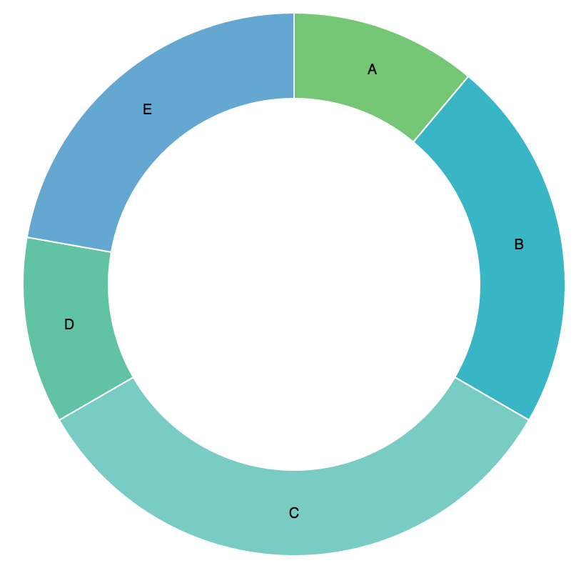
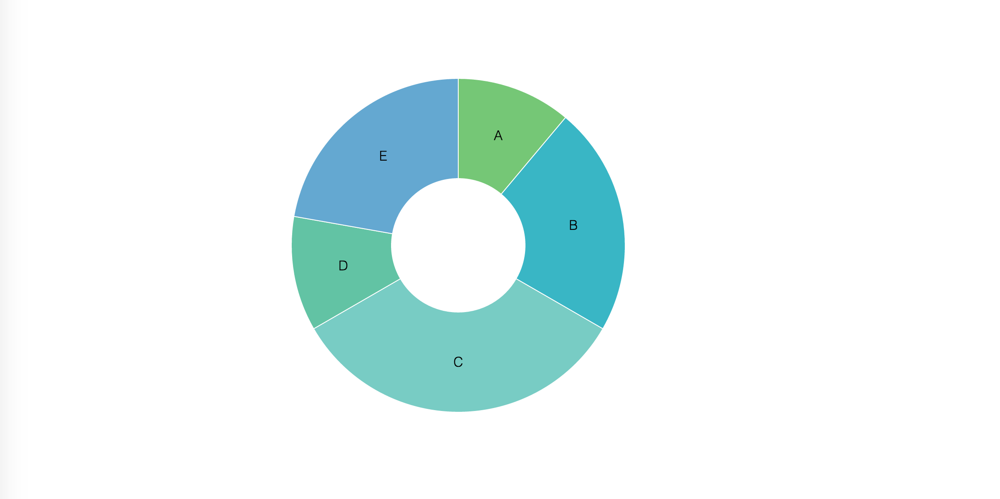
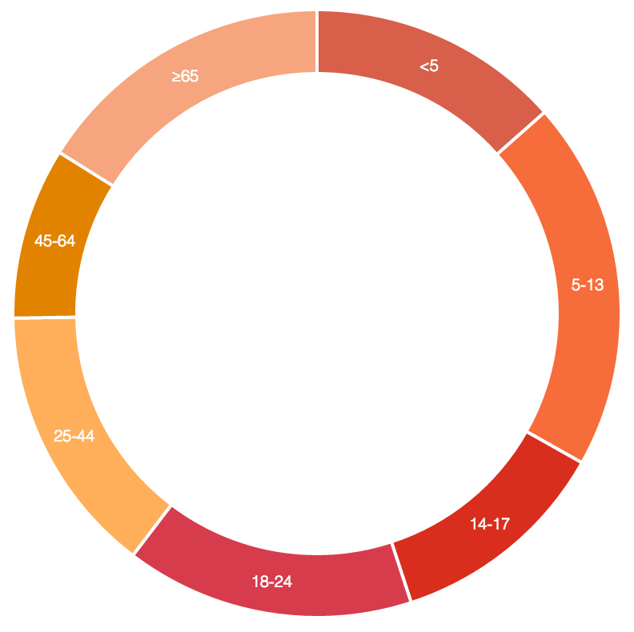
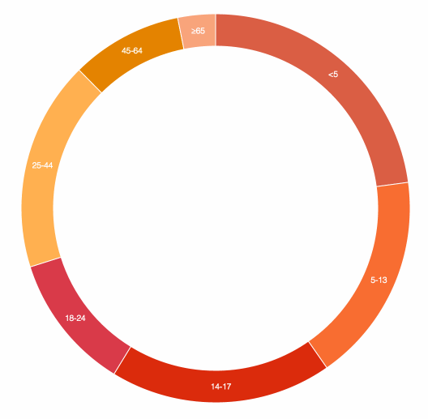

[![Travis Status][trav_img]][trav_site]


Victory Donut
============

`victory-donut` draws an SVG donut chart with your data.
Styles and data can be overridden by passing in new values.
Data changes are animated with `victory-animation`.

## Examples

The plain component has sample data, so rendering the component with no passed in properties:

``` javascript
<VictoryDonut/>
```

Will look like this:



All applied styles (fontColor, fontFamily, fontSize, fontWeight, height, sliceColors,
sliceWidth, strokeColor, strokeWidth, width) can be overridden.

``` javascript
<VictoryDonut
  fontWeight={200}
  sliceWidth={120}/>
```

Makes this:



Similarly,

``` javascript
<VictoryDonut
  fontColor="white"
  strokeWidth={2}/>
```
Makes this:


Or you can pass in your own data and sliceColors arrays:

``` javascript
<VictoryDonut
  data={[
    {x: "<5", y: 6279},
    {x: "5-13", y: 9182},
    {x: "14-17", y: 5511},
    {x: "18-24", y: 7164},
    {x: "25-44", y: 6716},
    {x: "45-64", y: 4263},
    {x: "≥65", y: 7502}
  ]}
  fontColor="white"
  fontWeight={200}
  sliceColors={[
    "#D85F49",
    "#F66D3B",
    "#D92E1D",
    "#D73C4C",
    "#FFAF59",
    "#E28300",
    "#F6A57F"
  ]}
  sliceWidth={50}
  strokeWidth={2}/>
```

Makes:



If the data changes, the donut updates seamlessly.



## The API

### Props

All props are **optional**. They can be omitted, and the component will
still render.

The following props are supported:

#### `data`

Primary way to pass in a data set for plotting. If the `data` prop is omitted,
`victory-donut` will render sample data.

`data`, must be of the form `[{x: <x val>, y: <y-val>}]`, where `<x-val>` and `<y-val>` are numbers.

#### `fontColor`

A string: "#ff0000", rgba(255, 0, 0, 1)", "red" all work.

**Defaults to:** `"black"`

#### `fontFamily`

A string.

**Defaults to:** `"Helvetica"`

#### `fontSize`

A number or string. Numbers will automatically be assigned as pixels.
Other units are accepted, but the value needs to be passed in as a string. Example: `"2em"`.

**Defaults to:** `10`

#### `fontWeight`

A number.

**Defaults to:** `200`

#### `height`

A number.

**Defaults to:** `400`

#### `sliceColors`

An array.

**Defaults to:** `["#75C776", "#39B6C5", "#78CCC4", "#62C3A4", "#64A8D1", "#8C95C8", "#3BAF74"]`

#### `sliceWidth`

A number or string. Numbers will automatically be assigned as pixels.
Other units are accepted, but the value needs to be passed in as a string. Example: `"2em"`.

**Defaults to:** `70`

#### `strokeColor`

A string: "#ff0000", rgba(255, 0, 0, 1)", "red" all work.

**Defaults to:** `"white"`

#### `strokeWidth`

A number or string. Numbers will automatically be assigned as pixels.
Other units are accepted, but the value needs to be passed in as a string. Example: `"2em"`.

**Defaults to:** `1`

#### `width`

A number.

**Defaults to:** `400`

## Build

Build for production use (NPM, bower, etc).

```
$ npm run build
```

Which is composed of commands to create `dist` UMD bundles (min'ed, non-min'ed)

```
$ npm run build-dist
```

and the ES5 `lib`:

```
$ npm run build-lib
```

Note that `dist/` files are only updated and committed on **tagged releases**.


## Development

All development tasks consist of watching the demo bundle, the test bundle
and launching a browser pointed to the demo page.

Run the `demo` application in a browser window with hot reload:
(More CPU usage, but faster, more specific updates)

```
$ npm run hot       # hot test/app server (OR)
$ npm run open-hot  # hot servers _and a browser window opens!_
```

Run the `demo` application with watched rebuilds, but not hot reload:

```
$ npm run dev       # dev test/app server (OR)
$ npm run open-dev  # dev servers _and a browser window opens!_
```

From there you can see:

* Demo app: [127.0.0.1:3000](http://127.0.0.1:3000/)
* Client tests: [127.0.0.1:3001/test/client/test.html](http://127.0.0.1:3001/test/client/test.html)

## Quality

### In Development

During development, you are expected to be running either:

```
$ npm run dev
$ npm run hot
```

to build the src and test files. With these running, you can run the faster

```
$ npm run check-dev
```

Command. It is comprised of:

```
$ npm run lint
$ npm run test-dev
```

Note that the tests here are not instrumented for code coverage and are thus
more development / debugging friendly.

### Continuous Integration

CI doesn't have source / test file watchers, so has to _build_ the test files
via the commands:

```
$ npm run check     # PhantomJS only
$ npm run check-cov # (OR) PhantomJS w/ coverage
$ npm run check-ci  # (OR) PhantomJS,Firefox + coverage - available on Travis.
```

Which is currently comprised of:

```
$ npm run lint      # AND ...

$ npm run test      # PhantomJS only
$ npm run test-cov  # (OR) PhantomJS w/ coverage
$ npm run test-ci   # (OR) PhantomJS,Firefox + coverage
```

Note that `(test|check)-(cov|ci)` run code coverage and thus the
test code may be harder to debug because it is instrumented.

### Client Tests

The client tests rely on webpack dev server to create and serve the bundle
of the app/test code at: http://127.0.0.1:3001/assets/main.js which is done
with the task `npm run server-test` (part of `npm dev` and `npm hot`).

#### Code Coverage

Code coverage reports are outputted to:

```
coverage/
  client/
    BROWSER_STRING/
      lcov-report/index.html  # Viewable web report.
```

## Releases

Built files in `dist/` should **not** be committeed during development or PRs.
Instead we _only_ build and commit them for published, tagged releases. So
the basic workflow is:

```
# Update version
$ vim package.json # and bump version
$ git add package.json

# Create the `dist/*{.js,.map}` files and publish working project to NPM.
$ npm publish
# ... the project is now _published_ and available to `npm`.

# Commit, tag
$ git add dist/
$ git commit -m "Bump version to vVERS"
$ git tag -a "vVERS" -m "Version VERS"
$ git push
$ git push --tags
# ... the project is now pushed to GitHub and available to `bower`.
```

Side note: `npm publish` runs `npm prepublish` under the hood, which does the
build.

## Contributing

Please see [CONTRIBUTING](CONTRIBUTING.md)

[trav_img]: https://api.travis-ci.org/FormidableLabs/formidable-react-component-boilerplate.svg
[trav_site]: https://travis-ci.org/FormidableLabs/formidable-react-component-boilerplate

