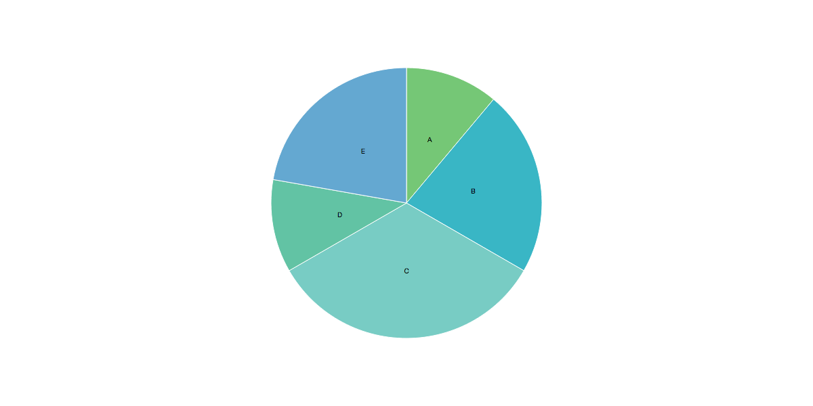
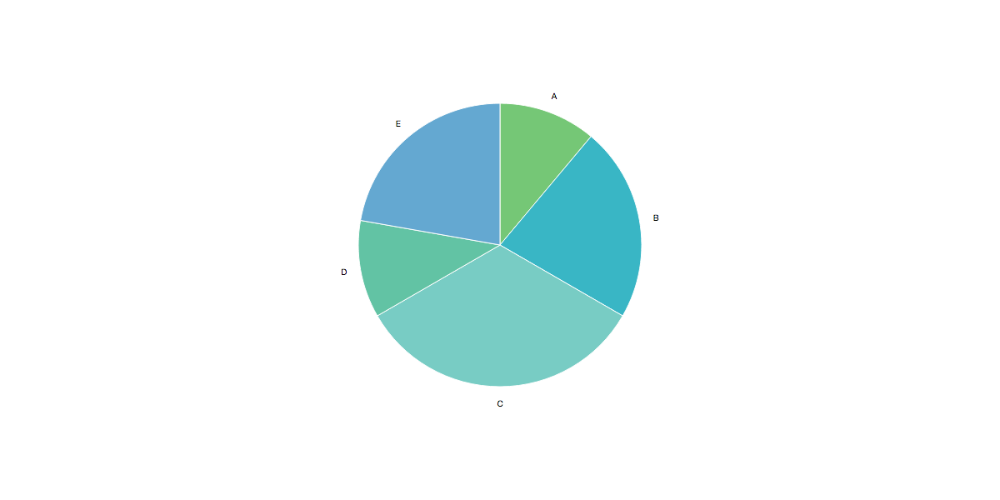
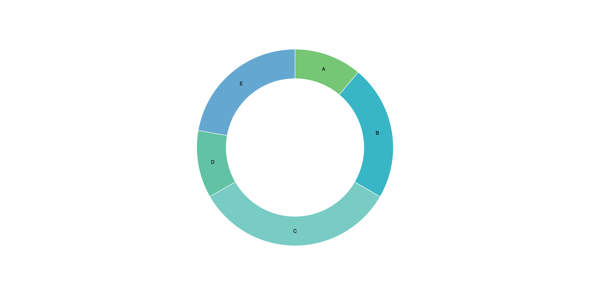
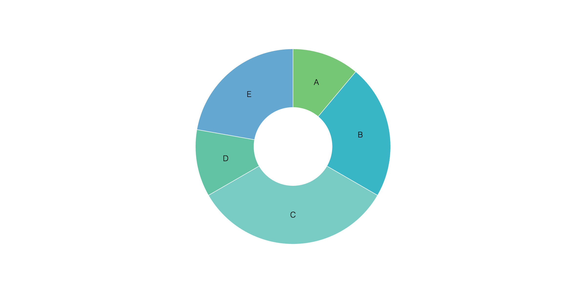
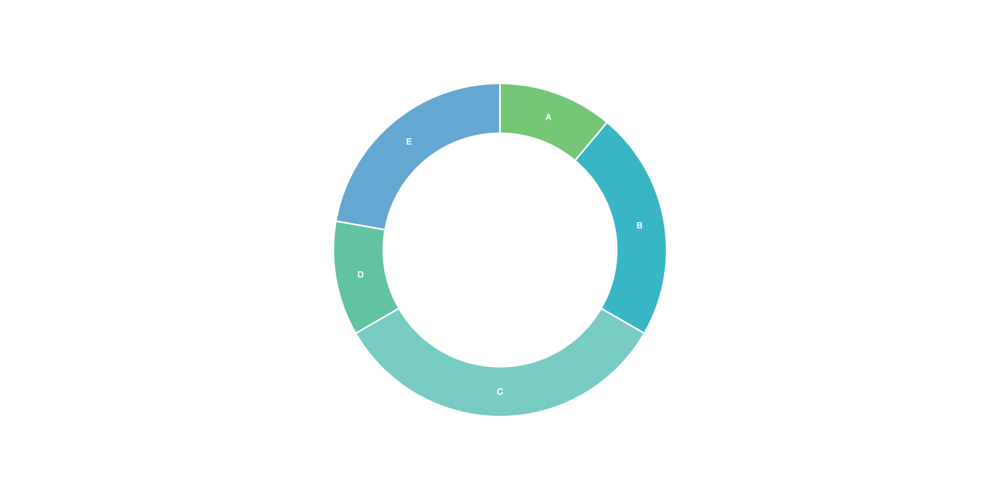
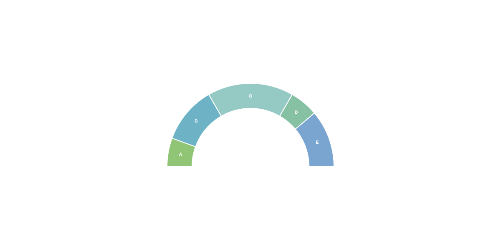
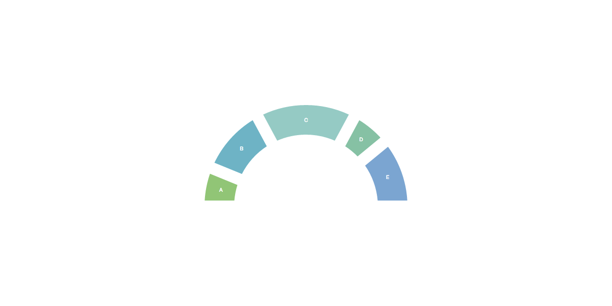
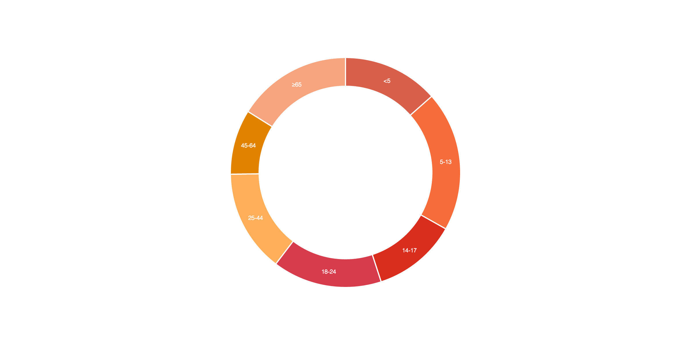
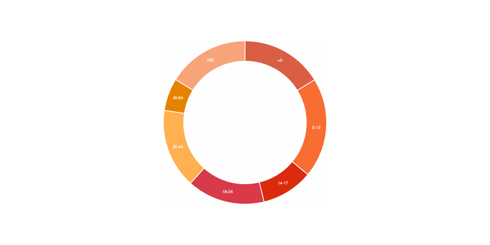
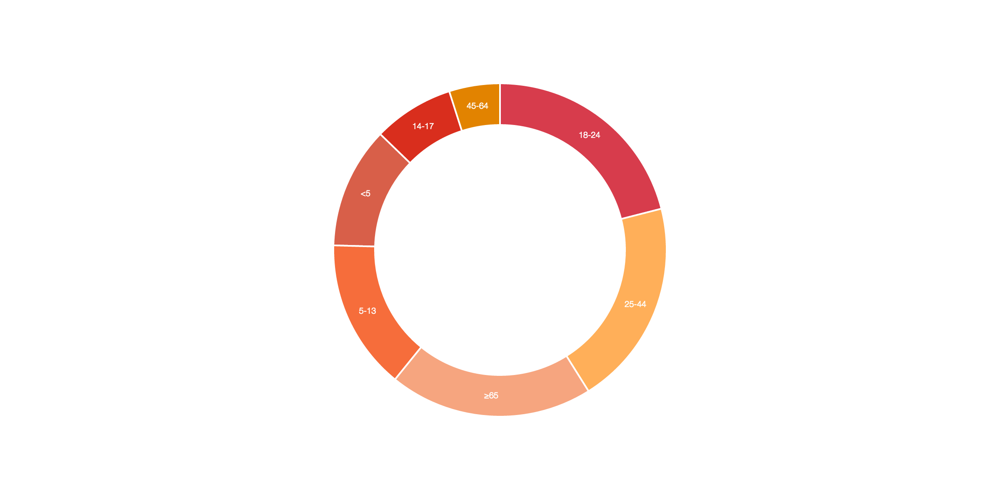

Victory Pie
=============

`victory-pie` draws an SVG pie or donut chart with [React](https://github.com/facebook/react) and [D3](https://github.com/mbostock/d3). Styles and data can be customized by passing in your own values as properties to the component. Data changes are animated with [victory-animation](https://github.com/FormidableLabs/victory-animation).

##Examples

The plain component has baked-in sample data, style, angle, and sort defaults, so rendering the pie with no custom properties, like so:

``` javascript
<VictoryPie/>
```

Will look like this:



Labels, by default, are placed at the centroid of each pie slice, which can look a little strange sometimes. Apply `padding` and `labelPadding` like so:

``` javascript
<VictoryPie
  labelPadding={180}
  padding={30}/>
```

To move your labels out from the centroid:



But really, who wants a pie chart? Specify an `innerRadius` greater than 0 to turn the pie into a donut:

``` javascript
<VictoryPie innerRadius={140}/>
```

Yum:



All default styles (`borderColor`, `borderWidth`, `fontColor`, `fontFamily`, `fontSize`, `fontWeight`, `height`,  `innerRadius`, `labelPadding`, `padding`, `sliceColors`, `width`), angles (`startAngle`, `endAngle`, `padAngle`) and sorting (`sort`) can be overridden by specifying your own props:

``` javascript
<VictoryPie
  fontSize={16}
  fontWeight={200}
  innerRadius={80}/>
```

Makes this:



Similarly,

``` javascript
<VictoryPie
  borderWidth={2}
  fontColor="white"
  innerRadius={140}/>
```
Makes:



Want a half donut? Specify a `startAngle` and `endAngle`:

``` javascript
<VictoryPie
  borderWidth={2}
  endAngle={90}
  fontColor="white"
  innerRadius={140}
  startAngle={-90}/>
```
Voilà:


Specify a `padAngle` to add space between adjacent slices:

``` javascript
<VictoryPie
  borderWidth={2}
  endAngle={90}
  fontColor="white"
  innerRadius={140}
  padAngle={5}
  startAngle={-90}/>
```


Custom data (age vs population) and colors:

``` javascript
<VictoryPie
  borderWidth={2}
  data={[
    {x: "<5", y: 6279},
    {x: "5-13", y: 9182},
    {x: "14-17", y: 5511},
    {x: "18-24", y: 7164},
    {x: "25-44", y: 6716},
    {x: "45-64", y: 4263},
    {x: "≥65", y: 7502}
  ]}
  fontColor="white"
  fontWeight={200}
  innerRadius={150}
  sliceColors={[
    "#D85F49",
    "#F66D3B",
    "#D92E1D",
    "#D73C4C",
    "#FFAF59",
    "#E28300",
    "#F6A57F"
  ]}/>
```

Snazzes things up a bit:



If the data changes, the donut updates seamlessly:



Set the `sort` prop to `"ascending"`, `"descending"`, or your own comparator:

``` javascript
<VictoryPie
  borderWidth={2}
  data={[
    { x: "<5", y: 4577 },
    { x: "5-13", y: 5661 },
    { x: "14-17", y: 3038 },
    { x: "18-24", y: 8151 },
    { x: "25-44", y: 7785 },
    { x: "45-64", y: 1911 },
    { x: "≥65", y: 7665 }
  ]}
  fontColor="white"
  fontWeight={200}
  innerRadius={150}
  sliceColors={[
    "#D85F49",
    "#F66D3B",
    "#D92E1D",
    "#D73C4C",
    "#FFAF59",
    "#E28300",
    "#F6A57F"
  ]}
  sort="descending"/>
```

To organize by slice size:



## The API

### Props

All props are *optional*. They can be omitted and the component will
still render.

The following props are supported:

####**borderColor**

*A string.* All color formats, including HEX, RGB/RGBA, and HTML color names are accepted. Examples: `"#ff0000"`, `"rgba(255, 0, 0, 1)"`, `"red"`.

*Default value:* `"white"`

####**borderWidth**

*A number or string.* Numbers are assigned as pixels. Numbers with specified units can be passed in as a string, such as `"2em"`.

*Default value:* `1`

####**data**

*An array of objects.* If the `data` prop is omitted, the pie will render sample data. Objects in the `data` array must be of the form `{ x: <x-val>, y: <y-val> }`, where `<x-val>` is the slice label (string or number), and `<y-val>` is the corresponding number used to calculate arc length as a proportion of the pie's circumference.

*Default value:* `[{ x: "A", y: 1 }, { x: "B", y: 2 }, { x: "C", y: 3 }, { x: "D", y: 1 }, { x: "E", y: 2 }]`

####**endAngle**

*A number.* The overall end angle of the pie in degrees.

*Default value:* `360`

####**fontColor**

*A string.* All color formats, including HEX, RGB/RGBA, and HTML color names are accepted. Examples: `"#ff0000"`, `"rgba(255, 0, 0, 1)"`, `"red"`.

*Default value:* `"black"`

####**fontFamily**

*A string.* Single font names or font stacks are accepted.

*Default value:* `"'Helvetica Neue', Helvetica, Arial, sans-serif"`

####**fontSize**

*A number or string.* Numbers are assigned as pixels. Numbers with specified units can be passed in as a string, such as `"2em"`.

*Default value:* `10`

####**fontWeight**

*A number or string.* All CSS `font-weight` properties (`100`, `200`, `300`, `400`, `500`, `600`, `700`, `800`, `900`, `"normal"`, `"bold"`, `"bolder"`, `"lighter"`, `"initial"`, `"inherit"`) are accepted.

*Default value:* `400`

####**height**

*A number.* A pixel amount used to calculate chart size. The smaller of the two dimension properties, `height` and `width`, will be used to set diameter. Note that any specified `padding` is included in overall chart dimensions, so the diameter of the pie will be smaller if `padding` is greater than 0.

*Default value:* `400`

####**innerRadius**

*A number.* A pixel amount used to calculate the distance between the center of the chart and the inner edge of a donut.

*Default value:*  `0`

####**labelPadding**

*A number.* A pixel amount used to position labels further out from the centroid of a pie slice.

*Default value:*  `0`

####**padAngle**

*A number.* The pad angle of the pie in degrees. Adjacent slices will be separated by the pad angle.

*Default value:* `0`

####**padding**

*A number.* A pixel amount used to add padding around the outer edge of the pie.

*Default value:* `0`

####**sliceColors**

*An array of strings.* If the `data` array is longer than its corresponding `sliceColors` array, slice color assignments will continue by looping through the array.

*Default value:* `["#75C776", "#39B6C5", "#78CCC4", "#62C3A4", "#64A8D1", "#8C95C8", "#3BAF74"]`

####**sort**

*A string or function.* Sort order strings `"ascending"` and `"descending"`are accepted, as are custom comparator functions.

*Default value:* `null`

####**startAngle**

*A number.* The overall start angle of the pie in degrees.

*Default value:* `0`

####**width**

*A number.* A pixel amount used to calculate chart size. The smaller of the two dimension properties, `height` and `width`, will be used to set diameter. Note that any specified `padding` is included in overall chart dimensions, so the diameter of the pie will be smaller if `padding` is greater than 0.

*Default value:* `400`

## Development

Please see [DEVELOPMENT](DEVELOPMENT.md)

## Contributing

Please see [CONTRIBUTING](CONTRIBUTING.md)

[trav_img]: https://api.travis-ci.org/FormidableLabs/victory-pie.svg
[trav_site]: https://travis-ci.org/FormidableLabs/victory-pie
