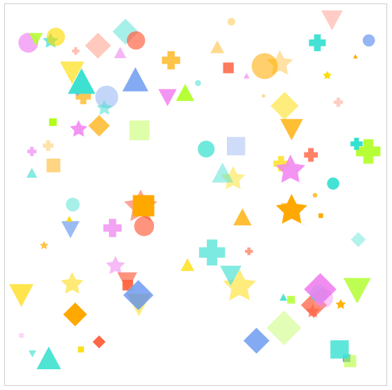
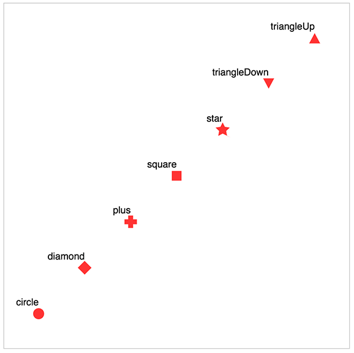

Victory Scatter
=========================

Victory Scatter creates a scatter of points from data. Scatter is a composable component, so it does not include an axis.  Check out Victory Chart for easy to use scatter plots and more.

## Examples

Victory Scatter is written to be highly configurable, but it also includes a set of sensible defaults and fallbacks. If no props are provided,

```
 <VictoryScatter/>
```

Victory Scatter will render mock data to help you get started


If you set `animate={true}` Victory Scatter will smoothly transition to a new state as data changes. Supported interpolation attributes are position, color, opacity, and size.  Shape interpolation coming soon.



---

## API

There are several configuration options for Victory Scatter, but if only the `data` is prop is provided, a sensible scatter will still be rendered.

### Props

All props are optional, but you wont get very far without passing in some data.

#### data

This prop should be an array of data objects in the following form

```
{
  x: number,
  y: number,
  color: string (optional),
  opacity: number (optional),
  symbol: string (optional),
  size: number (optional),
  ...
}
```

`x` and `y` data attributes are required to determine the position of each data point.  The additonal attributes described above can be included in each data object if you want to style points individually, or included in the `style` prop to style entire data sets. If data is not provided, mock data will be used as described above.

**PropTypes** Array of objects

**Default** Calculated mock data

#### scale

This prop determines what scale your scatter component should use. This prop should return a function, or an object in the form:

```
scale: {
  x: func,
  y: func
}
```

Most d3 scale functions are supported.

**PropTypes** func, or object with function values for x and y

**Default** scale: `() => d3.scale.linear()`

#### domain

This prop describes the range of *input* values the scatter component will cover. This prop should be given as an array of the minimum and maximum expected values for your scatter component, or as an object in the form:

```
domain: {
  x: [min, max],
  y: [min, max]
}
```

 If this prop isn't provided Victory Scatter will try to assign a domain based on `data`, or the default domain of the scatter scale. Most d3 scales have default domains of `[0, 1]`. Ordinal, quantile, threshold, and time scales need a specified domain or `data`. Identity scales require the domain and range to be identical, so by default, Victory Scatter will set the default domain equal to the range when these scales are used.  If you are using an identity scale, and you want to specify a custom domain, you will also need to specify an identical custom range, or the custom domain will be overridden.

**PropTypes** array, or object of array values for x and y

**Default** calculated

#### range

This prop describes the *output* range of values the axis will cover.
It's reasonable to think of the relationship between Victory Scatter domains and ranges as a mapping between the spread of data you want to cover, and the space you have to display it. By default this prop is calculated based on the width, height, and margin attributes of the style object.  In most cases, using the default calculated range is a good idea, but if you want to use a custom range, just pass in an array containing the minimum and maximum expected value for the range, or an object in the form:

```
range: {
  x: [min, max],
  y: [min, max]
}
```

**PropTypes** array or object of array values for x and y

**Default** calculated

#### style

Victory Scatter is styled inline with [Radium](http://github.com/formidablelabs/radium). The default styles are as follows:

```
{
  borderColor: "transparent",
  borderWidth: 0,
  color: "#756f6a",
  opacity: 1,
  margin: 20,
  width: 500,
  height: 500,
  fontFamily: "Helvetica",
  fontSize: 10,
  textAnchor: "middle"
}
```

Any styles passed in as props will be merged with this set of default styles.

**PropTypes** node

**Default** See above

### containerElement

This prop determines whether to render Victory Scatter in a `<g>` or `<svg>` element. It is useful to set this prop to "g" if you are composing Victory Scatter with other victory components.

**PropTypes** "g" or "svg"

**Default** `containerElement: "svg"`

#### animate

This prop determines whether or not to animate transitions as data changes.  Animation is handled by [Victory Animation](https://github.com/FormidableLabs/victory-animation)

**PropTypes** bool

**Default** `animate: false`

#### symbol

This prop determines which symbol to use each data point. Supported options are "circle", "diamond", "plus", "square", "star", "triangleDown", "triangleUp". The rendered symbols look like this:



**PropTypes** "circle", "diamond", "plus", "square", "star", "triangleDown", or "triangleUp"

**Default** `symbol: "circle"`

#### size

This prop determines how large each data point should be.

**PropTypes** number

**Default** `size: 3`

#### bubbleProperty

If the value of this prop matches a key in your data object, the values associated with that key will be used to scale the size of each data point, creating a bubble plot. If a valid `bubbleProperty` value is specified, the symbol plotted for each data point will always be a circle

**PropTypes** string

**Default** undefined

#### maxBubbleSize

This prop corresponds to the maximum size of a data point in a bubble plot.  This value is only relevant when a valid `bubbleProperty` is specified. If `maxBubbleSize` is not specified, the maximum size of a data point in a bubble plot will be calculated based on the margin.

**PropTypes** number

**Default** undefined

#### labelPadding

This value is how much padding your label should get. If a data object includes a label value, and this value is not provided, label padding will be calculated based on the size of whatever data point the label corresponds to.

**PropTypes** number

**Default** calculated

#### showLabels

This prop is a boolean that determines whether to render labels for data objects that include label values. If you're rendering a large number of data, you might want to set this prop to false, as it will improve animation performance by halving the number of svg nodes that need to be rendered.

**PropTypes** bool

**Default** `showLabels: true`

---

## Coming Soon!

- Better label rendering
- shape interpolation
- Test Coverage!

## Development

Please see [DEVELOPMENT](DEVELOPMENT.md)

## Contributing

Please see [CONTRIBUTING](CONTRIBUTING.md)

[trav_img]: https://api.travis-ci.org/FormidableLabs/victory-scatter.svg
[trav_site]: https://travis-ci.org/FormidableLabs/victory-scatter
